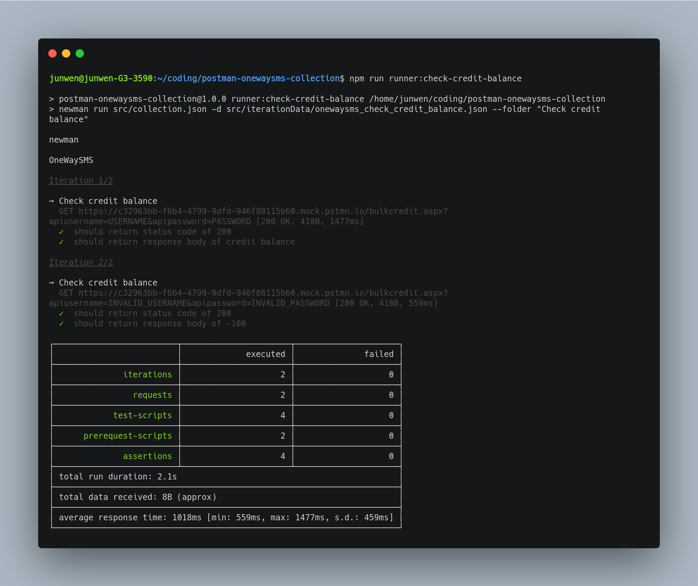
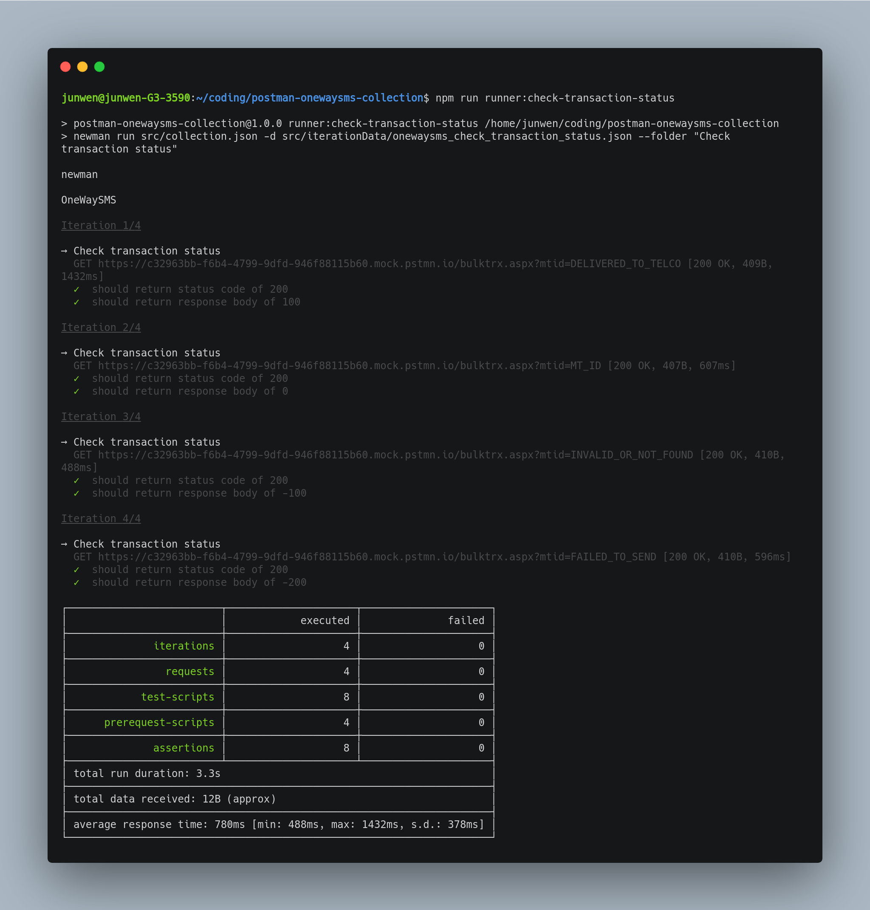
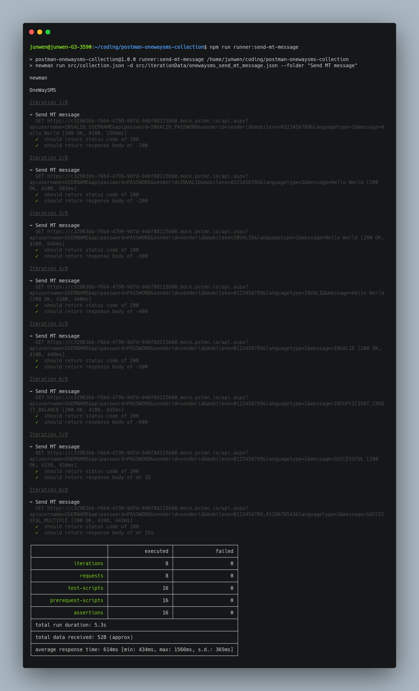

# postman-onewaysms-collection

Postman Collection for Malaysia OneWaySMS. Requests in the collection are based on this API [documentation](http://smsd2.onewaysms.sg/api.pdf).

By default, API call will route to [this](https://www.postman.com/junwen-k/workspace/onewaysms/mock/c32963bb-f6b4-4799-9dfd-946f88115b60) mock server generated using Postman.

## Getting Started

To install dependencies, run

    npm install

To initiate runner using [`newman`](https://www.npmjs.com/package/newman), run

    npm run runner:REQUEST_NAME

## Collection Runners

    npm run runner:check-credit-balance

    npm run runner:check-transaction-status

    npm run runner:send-mt-message

## 📜 License

[MIT](./LICENSE)
